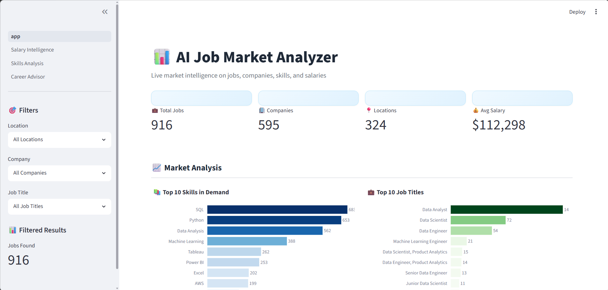

# AI Job Market Analyzer 📊

A professional Streamlit analytics dashboard that analyzes AI/Data Science job market trends, salary patterns, skill demands, and career paths using real-world datasets.

---

## Overview 🚀

AI Job Market Analyzer is a multi-page Streamlit dashboard designed to help students, job seekers, and aspiring data professionals understand the current AI and Data Science job market.

### Key Highlights

* 📌 987 AI/Data Science job postings analyzed
* 💰 607 salary records explored
* 📚 19 technical skills extracted and ranked
* 📊 Interactive Plotly visualizations
* 🚀 Career path recommendations and learning roadmaps

---

## Screenshots 📸

### 🏠 Main Dashboard



### 💰 Salary Intelligence


### 📚 Skills Analysis


### 🚀 Career Advisor


---

## Features 🎯

### 📊 Main Dashboard

* KPI metrics (Jobs, Companies, Locations, Average Salary)
* Interactive filters by location, company, and job title
* Top 10 skills in demand
* Top 10 job titles
* Top 10 hiring companies
* Top 10 hiring locations
* Job posting trends over time
* Salary distribution analysis

### 💰 Salary Intelligence

* Salary analysis by experience level
* Salary comparison by company size
* Salary comparison by remote work type
* Top 20 highest-paying job titles
* Salary distribution and statistical insights

### 📚 Skills Analysis

* Top 20 in-demand skills
* Skill frequency distribution
* Skill combination analysis
* Skills demand ranking
* Most valuable skill pairings

### 🚀 Career Advisor

* Interactive career path explorer
* Data Analyst roadmap
* Data Scientist roadmap
* Backend Developer roadmap
* Frontend Developer roadmap
* Full Stack Developer roadmap
* Required skills by role
* Learning path recommendations
* Salary expectations and market demand
* Top hiring locations

---

## Project Structure 📁

```text
AI_Job_Market_Analyzer/
├── app.py
├── pages/
│   ├── 1_Salary_Intelligence.py
│   ├── 2_Skills_Analysis.py
│   └── 3_Career_Advisor.py
├── assets/
│   ├── dashboard.png
│   ├── salary_intelligence.png
│   ├── skills_analysis.png
│   └── career_advisor.png
├── data/
│   ├── jobs_cleaned.csv
│   ├── salaries_cleaned.csv
│   ├── skill_frequency.csv
│   └── jobs_with_skills.csv
├── utils/
│   ├── __init__.py
│   ├── data_cleaners.py
│   └── skill_extractor.py
├── requirements.txt
├── data_cleaning.py
├── eda_analysis.py
├── .gitignore
└── README.md
```

---

## Installation & Setup ⚙️

### Prerequisites

* Python 3.8+
* pip

### Clone Repository

```bash
git clone https://github.com/YOUR_USERNAME/AI_Job_Market_Analyzer.git
cd AI_Job_Market_Analyzer
```

### Create Virtual Environment

```bash
python -m venv venv
```

#### Windows

```bash
venv\Scripts\activate
```

#### Linux / macOS

```bash
source venv/bin/activate
```

### Install Dependencies

```bash
pip install -r requirements.txt
```

### Run Application

```bash
streamlit run app.py
```

### Open Browser

```text
http://localhost:8501
```

---

## Dataset Information 📈

### Data Sources

| Dataset              | Records               |
| -------------------- | --------------------- |
| jobs_cleaned.csv     | 987 Job Postings      |
| salaries_cleaned.csv | 607 Salary Records    |
| skill_frequency.csv  | 19 Technical Skills   |
| jobs_with_skills.csv | Skill Mapping Dataset |

### Data Quality

* ✅ Null values removed
* ✅ Duplicate records removed
* ✅ Company names standardized
* ✅ Categories normalized
* ✅ Date formats cleaned
* ✅ Skill extraction performed

---

## Top Skills Extracted 📚

| Rank | Skill            | Mentions |
| ---- | ---------------- | -------- |
| 1    | SQL              | 683      |
| 2    | Python           | 653      |
| 3    | Data Analysis    | 562      |
| 4    | Machine Learning | 388      |
| 5    | Tableau          | 262      |
| 6    | Power BI         | 253      |
| 7    | Excel            | 202      |
| 8    | AWS              | 199      |

---

## Key Insights 💡

### Market Demand

Most AI/Data Science roles require a combination of 3–5 technical skills rather than expertise in a single technology.

### Salary Trends

Experience level and company size have the strongest influence on salary growth.

### Skill Combinations

Frequently occurring skill combinations include:

* SQL + Python
* Python + Machine Learning
* SQL + Data Analysis
* Tableau + Power BI

### Career Growth

A common progression path is:

```text
Data Analyst
      ↓
Senior Data Analyst
      ↓
Data Scientist
      ↓
Senior Data Scientist
      ↓
ML Engineer / AI Specialist
```

---

## Technology Stack 🛠️

| Component       | Technology           |
| --------------- | -------------------- |
| Language        | Python               |
| Web Framework   | Streamlit            |
| Data Processing | Pandas, NumPy        |
| Visualization   | Plotly Express       |
| Charts          | Plotly Graph Objects |
| Data Storage    | CSV Files            |

---

## Usage Tips 💡

### Dashboard

Use filters to analyze specific companies, locations, or job titles.

### Salary Intelligence

Compare salaries based on:

* Experience level
* Company size
* Remote work type

### Skills Analysis

Identify:

* Trending skills
* Skill combinations
* Most demanded technologies

### Career Advisor

Explore:

* Career roadmaps
* Required skills
* Salary expectations
* Market demand

---

## Future Enhancements 🚀

* [ ] Real-time job market integration
* [ ] AI-powered skill recommendations
* [ ] Personalized learning paths
* [ ] Industry-specific analysis
* [ ] Interview preparation roadmap
* [ ] Salary prediction model
* [ ] Resume skill gap analyzer
* [ ] Learning resource recommendations

---

## Performance ⚡

* Streamlit caching for faster loading
* Interactive Plotly charts
* Responsive dashboard layout
* Optimized data processing pipeline

---

## Troubleshooting 🔧

### Missing Data Files

Ensure these files exist:

```text
data/jobs_cleaned.csv
data/salaries_cleaned.csv
data/skill_frequency.csv
data/jobs_with_skills.csv
```

### Streamlit Port Already In Use

```bash
streamlit run app.py --server.port 8502
```

### Recreate Virtual Environment

```bash
python -m venv venv

# Windows
venv\Scripts\activate

# Linux/macOS
source venv/bin/activate

pip install -r requirements.txt
```

---

## License 📄

This project is licensed under the MIT License.

---

## Author 👨‍💻

**Vasu Diyora**

B.Tech Information Technology Student
Dharmsinh Desai University

---

⭐ If you found this project useful, consider giving it a star on GitHub!
